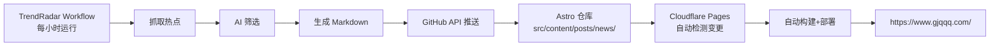

# TrendRadar + Astro 博客集成配置指南

## 📋 前置条件

✅ **Astro 项目**：已恢复到原始状态（commit `ba68552`）  
✅ **TrendRadar 项目**：已重新 fork（garcci/TrendRadar）  
✅ **架构**：TrendRadar → GitHub API → Astro 仓库 → Cloudflare Pages 自动部署

---

## 🔧 配置步骤

### 第 1 步：创建 GitHub Personal Access Token

1. 访问 https://github.com/settings/tokens
2. 点击 "Generate new token (classic)"
3. 权限设置：
   - ✅ **repo** (Full control of private repositories)
     - repo:status
     - repo_deployment
     - public_repo
     - repo:invite
4. 生成并复制 Token（格式：`ghp_xxxxxxxxxxxx`）

### 第 2 步：设置 GitHub Secrets

在 **TrendRadar 仓库**中设置以下 Secrets：

```bash
# 切换到 TrendRadar 目录
cd /Users/garcci/Library/Favorites/Lingma/TrendRadar

# 设置 Secrets
gh secret set ASTRO_GITHUB_TOKEN --body 'YOUR_GITHUB_TOKEN_HERE'
gh secret set ASTRO_REPO_OWNER --body 'garcci'
gh secret set ASTRO_REPO_NAME --body 'Astro'
gh secret set ASTRO_BRANCH --body 'master'
gh secret set ASTRO_BASE_PATH --body 'src/content/posts/news'
gh secret set GIT_USER_NAME --body 'TrendRadar Bot'
gh secret set GIT_USER_EMAIL --body 'bot@gjqqq.com'
```

或者手动在 GitHub 界面设置：
- 进入 https://github.com/garcci/TrendRadar/settings/secrets/actions
- 逐个添加上述 Secrets

### 第 3 步：验证配置

检查 config.yaml 中的存储配置：

```yaml
storage:
  backend: "auto"  # ✅ 必须是 auto
```

检查 workflow 是否包含环境变量（已在 crawler.yml 第 170-176 行配置）。

### 第 4 步：测试运行

手动触发 workflow：

```bash
cd /Users/garcci/Library/Favorites/Lingma/TrendRadar
gh workflow run crawler.yml
```

或在 GitHub 界面：
- Actions → Get Hot News → Run workflow

### 第 5 步：验证结果

1. 等待 workflow 完成（约 2-5 分钟）
2. 检查 Astro 仓库是否有新文章：
   ```bash
   cd /Users/garcci/Library/Favorites/Lingma/Astro
   git log --oneline -5
   ls src/content/posts/news/
   ```
3. 等待 Cloudflare Pages 自动部署（2-5 分钟）
4. 访问 https://www.gjqqq.com/ 查看新文章

---

## 🎯 工作流程



---

## ⚠️ 注意事项

### 1. 文章 Schema
生成的文章必须使用 `published` 字段（不是 `date`）：

```yaml
---
title: "TrendRadar Report - 2026-04-22"
published: 2026-04-22T00:00:00+08:00  # ✅ 正确
tags: [news, trendradar, hot]
category: news
draft: false
---
```

### 2. 文件路径
文章推送到：`src/content/posts/news/YYYY-MM-DD-trendradar-TIMESTAMP.md`

### 3. 分支名称
确保 `ASTRO_BRANCH` 设置为 `master`（不是 `main`）

### 4. Token 权限
Token 必须有 `repo` 权限才能推送文件

---

## 🔍 故障排查

### 问题 1：workflow 运行失败
检查 Logs，常见错误：
- `ASTRO_GITHUB_TOKEN not set` → 未设置 Secret
- `404 Not Found` → 仓库名称或所有者错误
- `403 Forbidden` → Token 权限不足

### 问题 2：文章没有出现在网站
- 检查 Cloudflare Pages 部署状态
- 清除浏览器缓存
- 检查文章 schema 是否正确（`published` 字段）

### 问题 3：分页问题
Astro 的分页链接应该带尾部斜杠：`/2/`（不是 `/2`）

---

## 📊 监控

查看 workflow 运行状态：
https://github.com/garcci/TrendRadar/actions

查看 Cloudflare Pages 部署状态：
https://dash.cloudflare.com/298718290c935a26d5016d3abe0b1c56/pages/view/astroe

---

**配置完成后，整个流程完全自动化，无需任何手动干预！** 🎉
